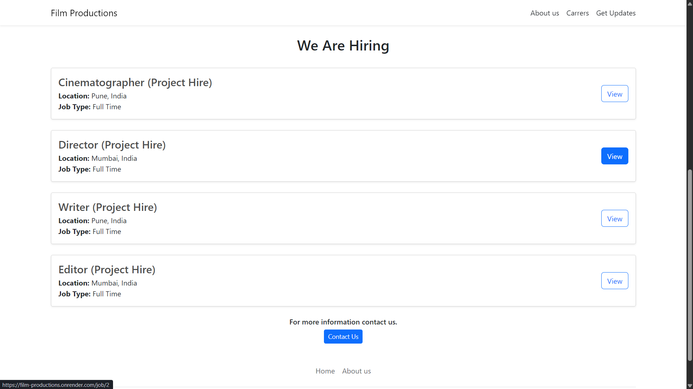
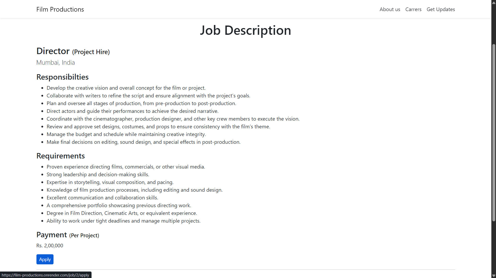
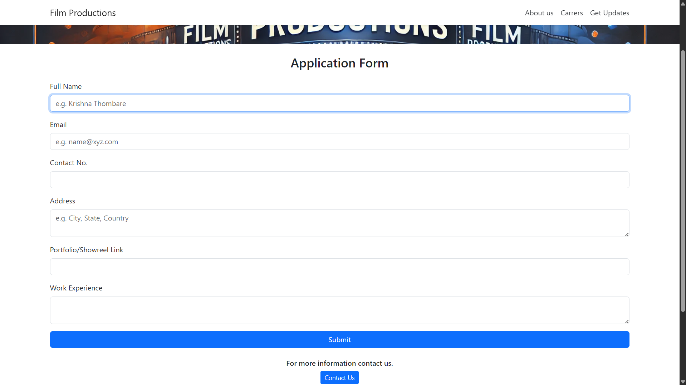

## 📌**Overview:**
Film Productions is a web application designed to help users discover and explore job opportunities in the filmmaking industry. The platform provides an easy-to-use
interface where users can browse available roles, view detailed job descriptions, submit application forms, and stay updated with the latest openings. This project 
aims to bridge the gap between talent and opportunity by aggregating job listings across various roles in the film industry, such as directors, editors, writers, 
cinematographers, and more.

## ✨ **Features:**
1. Browse job openings
2. View detailed job descriptions
3. Submit application form
4. Get latest update by signing up

## 🛠️ **Tech Stack:**
1. Backend:- Python, Flask
2. Database:- MySQL (Aiven Cloud)
3. Frontend:- HTML, CSS, Bootstrap
4. Deployment:- Render

## 🧠 **Architecture:**
1. RESTful routing for handling requests
2. SQLAlchemy ORM for database operations
3. Used Jinja2 for template rendering
4. Clear separation between backend and frontend logic

## 🚀 **Live Demo:**
https://film-productions.onrender.com/

## 📸 **Screenshots:**
### 🏠 Home Page

### 🏠 Job Listing

### 🏠 Job Description

### 🏠 Job Application

## 🤝 **Contributing:**
Contributions are welcome! Feel free to fork the repository and submit a pull request.

## 📬 **Contact:**
Krishnathombare43@gmail.com

⭐**~ If you found this project useful, consider starring the repository!**
